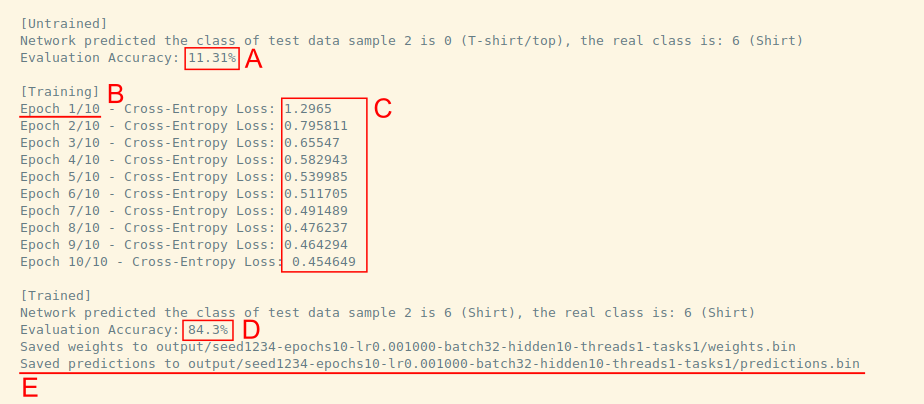

# AICE 2004 Coursework
Welcome! This repository contains the files to complete the AICE 2004 Parallel and Distributed Computing coursework. 

This repository contains a *Neural Network* defined in C++ that is trained and evaluted on the Fashion-MNIST dataset. Your job is to 

1. Identify optimisation opportunities in the code & apply them,
2. Paralellise the network's operations by splitting it across multiple threads with OpenMP and
3. Distribute the network's computations by spreading it across tasks (and nodes) with MPI and SLURM.

A key document to read is the [Coursework Specification](docs/specification/specification.pdf),
which gives the actual definition of what you need to achieve, including marks break-down.

General resources:
- [Coursework Specification](docs/specification/specification.pdf) : the specification.
- [Marking Repository](https://git.soton.ac.uk/aice2004/marking) (Not available as of 2025/11/18) : this is a
  repository that contains a sub-set of the tests used to evaluate the coursework, and will become available
  for self-test purposes.
- [Neural Network Crash Course](docs/neural-network-crash-course.md) : optional information on what the program is actually doing -- Best viewed on GitLab.

# Setup
Let's get started by making sure that we can actually run the program of the network.
Here we include all the commands you should need for running this on Iridis 5/X,
e.g. by logging into `loginx002.iridis.soton.ac.uk`.

Note that this is a new coursework, so there may well be teething issues.
Please report issues via the issue submissions systems at https://git.soton.ac.uk/aice2004/coursework/-/issues,
and also check whether other people have already asked the same question or
had the same problem.


## 1. Environment
We need some specific packages to run this program, for which we use `conda`. Here we detail how to get it configured & started.

1. **Clone this repository:**
   ```bash
   git clone https://git.soton.ac.uk/aice2004/coursework.git
   cd coursework
   ```

2. **Configure conda storage directories:**
   
   Load the conda module:
   ```bash
   module load conda
   ```

   Iridis' default home directory (`/home/$USER`) has file restrictions because it is backed up. The scratch directory (`/scratch/$USER`) does not have this restriction but is not backed up, so it is wise to tell conda to install things there. 
   ```bash
   mkdir -p /scratch/$USER/conda/pkgs /scratch/$USER/conda/envs
   conda config --add envs_dirs /scratch/$USER/conda/envs
   conda config --add pkgs_dirs /scratch/$USER/conda/pkgs
   ```

3. **Initialize your shell with conda**

   This enables the conda runtime for your user permanently.
   ```
   conda init
   ```
4. **Create the conda environment:**

   Use our provided file `conda-environment.yml`
   
   ```bash
   conda env create -f conda-environment.yml
   ```

5. **Activate the environment:**

   Run this command to activate the `aice` environment, which contains all the compilers & libraries required for this coursework.
   ```bash
   conda activate aice
   ```
   
## 2. Building

   As per the Contract in the Specification, you must be able to build the project using `scripts/build.sh`.
   You need the `cmake` module loaded:
   ```
   module load cmake
   ```

   Then just run the executable to build it:
   ```bash
   ./scripts/build.sh # Builds the project
   ```

   In case you need to modify it later, open it and look for this:
   ```bash
   ##### INSERT BUILD INSTRUCTIONS BELOW THIS LINE #####
   cmake -DCMAKE_BUILD_TYPE=Release ..
   cmake --build . --config Release
   ##### INSERT BUILD INSTRUCTIONS ABOVE THIS LINE #####
   ```
   Please do not change anything outside of the comments.

## 3. Downloading the dataset

   To train a neural network, you naturally need a dataset to train it with. For this, we use Fashion-MNIST, 60,000 training and 10,000 testing images of 10 everyday items. 
   
   Before running the network, you need to download this dataset with the provided script:
   ```
   cd data
   ./download-fashion-mnist.sh 
   cd ..
   ```

## 4. Running
   As per the Contract in the Specification, you must be able to run the project using `scripts/run.sh`. You must provide the required arguments to run this:
   ```
   scripts/run.sh -s 1234 -e 10 -l 0.001 -b 32 -z 10 --threads 1 --tasks 1
   ```
   You will have to modify this later, open the file and look for these lines:
   ```bash
   ##### INSERT RUN INSTRUCTIONS BELOW THIS LINE #####
   build/main -s "$SEED" -e "$EPOCHS" -l "$LR" -b "$BATCH" -z "$HIDDEN" --threads "$THREADS" --tasks "$TASKS"   
   ##### INSERT RUN INSTRUCTIONS ABOVE THIS LINE #####
   ```

## 5. What does the program actually do?
In industry, you will find yourself facing this question very often. Remember the golden rule: "DON'T PANIC."

At this point, remember that your job isn't to understand exactly what the program is computing,
but rather only accelerate the computations. Despite the exercise being based on a learning
algorithm, there is also no particular advantage to AI students versus CE - it's just a program.

You will likely see an output similar to this:


Let's run through what the program does by analysing the labeled output:

**A**. This is the accuracy of the network before training. At 11.31%, it's practically selecting clothing articles at random.

**B**. Training consists of multiple 'epochs', this is the amount of times you expose the network to the *entire* dataset. The higher, typically the better accuracy. 

**C**. This is the Cross-Entropy Loss of each training epoch, you can think of it as "the difference between what I think I'm looking at vs. what it actually is". As you can see, with each epoch (the more you get exposed to it) the loss goes lower, therefore improving the accuracy.

**D**. The evaluation accuracy after training. We see that training was effective, as we go from 11% -> 84% accuracy.

**E**. Saving of the predictions for later evaluation. Very important step, don't touch this!

Finally, you have the weights & predictions of a trained network, so you have succesfully trained a neural network in your environment!

If you would like to know more details about what's happening, there is a quick crash course on the operations of a neural network here: 

[Neural Network Crash Course](neural-network-crash-course.md)

# What next?
So, now that you have the program running, how can you go about improving it?

This section runs over all the important bits of the code, with links to files, and suggests which files you should and shouldn't change to comply with the Contract.

## Main file
*Should you edit this?* Only for library integration and debugging ⚙️ 

- Files:
   - [main.cpp](main.cpp)

The main file evaluates the untrained network, trains the network, evaluates the trained network and saves its predictions to the `output` directory.

You will want to edit this to integrate libraries (OMP, MPI, etc.) and for debugging, but please make sure the **execution structure described above is preserved**.

## Training procedure 
*Should you edit this?* Yes ✅

- Files:
   - Header: [Train.h](include/Train.h)
   - Implementation: [Train.cpp](src/Train.cpp)

Contains the functions 
1. `train_model` 
   - This actually calls the necessary methods to train the network by looping over the testing dataset `epoch` times.
   - This is the function that takes the longest to run in the program.

2. `evaluate_model`
   - This evaluates the provided network over the testing dataset.
   - Will not affect runtime nearly as much as `train_model`.

## The Neural Network
*Should you edit this?* Yes ✅

- Files:
   - Header: [Network.h](include/Network.h)
   - Implementation: [Network.cpp](src/Network.cpp)

Contains the `Network` class, which encompasses all the operations we need to train & evaluate the network. 
Functions:
- `Network::forward`: The forward pass of the network, what you use to generate the output.
- `Network::backpropagate`: The backward pass, used to adjust the weights (train).
- `Network::predict`: Return just the label for an input sample. Used for nicer outputs.

Most optimisation time is likely spent here.

## The Maths
*Should you edit this?* Yes ✅

- Files:
   - Header: [Maths.h](include/Maths.h)
   - Implementation: [Maths.cpp](src/Maths.cpp)

Contains the linear algebra functions that are required to forward and backward pass the `Network`.
Functions:
- `mat_times_vec`: Matrix-vector multiplication (returns vector).
- `vec_plus_vec`: Element-wise vector addition.
- `vec_minus_vec`: Element-wise vector subtraction.
- `sigmoid_vec`: Apply sigmoid activation function element-wise to a vector.
- `sigmoid_derivative`: Compute sigmoid derivative element-wise (for backpropagation).
- `softmax_vec`: Apply softmax function to convert vector to probability distribution.
- `cross_entropy_loss`: Compute cross-entropy loss between predicted and actual outputs.
- `transpose`: Transpose a matrix (swap rows and columns).
- `multiply_elementwise_vec`: Element-wise multiplication of two vectors (Hadamard product).
- `outer_product_into`: Compute outer product of two vectors into a pre-allocated matrix (non-allocating, resizes output).
- `outer_product`: Compute and return outer product of two vectors as a new matrix.

The initial implementation is designed to be readable, not optimal. 

## Loading Data & Arguments
*Should you edit this?* No ❌

These are files that handle the arguments to the program & the data. Generally you should not touch these as the version we ship is compliant with the contract.
- Files:
   - Arguments: [Arguments.h](include/Arguments.h)
   - DataLoader: [DataLoader.h](include/DataLoader.h)

## The build systems
*Should you edit this?* Yes ✅

So long as it complies with the contract and works on Iridis X, we assume you will be making changes to the build files, for example if you want to introduce new classes.
- Files:
  - CMake: [CMakeLists.txt](CMakeLists.txt)

